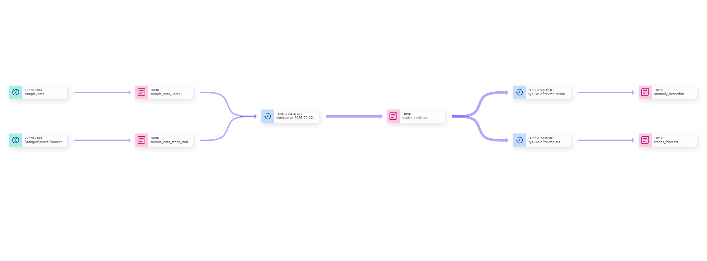
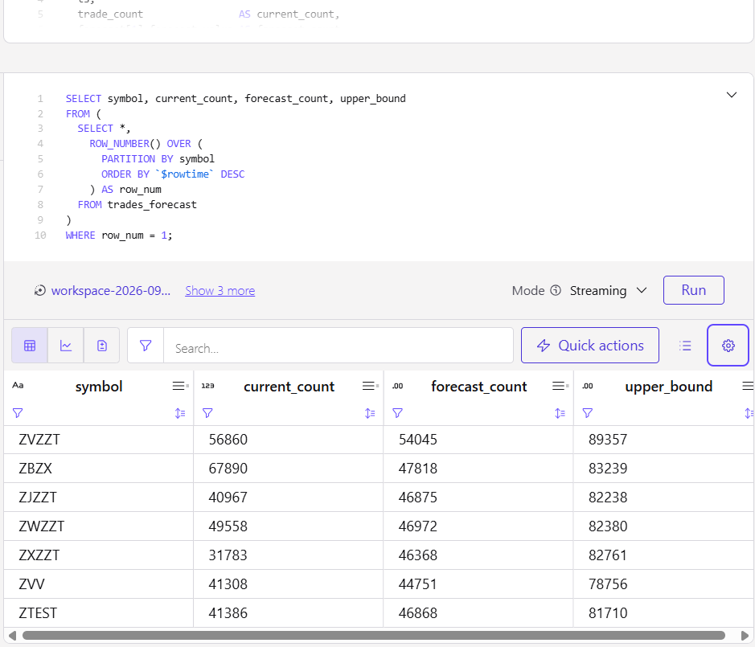
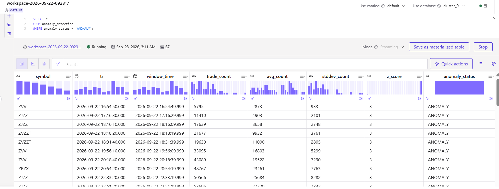

# Real-Time Trade Forecasting with Confluent

A real-time streaming analytics pipeline built during the **Confluent AI Developer Day 2026 Live Coding Challenge**.

Built live in an approximately **2-hour hands-on coding session** using continuously generated stock-trading data provided for the workshop.

The pipeline uses **Confluent Cloud, Apache Kafka, Apache Flink, and Flink SQL** to enrich streaming trades, forecast trading activity, and detect anomalous trading windows in real time.

## Architecture

```text
Datagen Users ──> sample_data_users ─────────────┐
                                                  │
                                                  ├──> Flink SQL
                                                  │     Enrichment
Datagen Trades ─> sample_data_stock_trades ──────┘
                                                        │
                                                        ▼
                                                 trades_enriched
                                                   │          │
                                                   │          │
                                                   ▼          ▼
                                             ML Forecast   Anomaly
                                                   │        Detection
                                                   ▼          ▼
                                           trades_forecast  anomaly_detection
```

## Stream Lineage



The Stream Lineage shows the end-to-end flow from source connectors and Kafka topics through Flink processing to the forecasting and anomaly-detection outputs.

## What I Built

- Generated continuous user and stock-trade event streams
- Ingested events into Kafka topics using Confluent connectors
- Enriched stock trades with user attributes using Flink SQL
- Processed trading activity using 10-second tumbling windows
- Forecast future trading activity with `ML_FORECAST`
- Detected unusual trading windows using rolling statistics and z-scores
- Queried forecast and anomaly results continuously
- Traced the complete pipeline using Confluent Stream Lineage

## Tech Stack

- Confluent Cloud
- Apache Kafka
- Apache Flink
- Flink SQL
- Confluent Sample Data / Datagen Connectors
- Confluent Stream Lineage
- Confluent `ML_FORECAST`

## Pipeline

### 1. Streaming Sources

Two continuously generated streams are used:

- `sample_data_users`
- `sample_data_stock_trades`

These provide user information and live stock-trading events for the hands-on challenge.

### 2. Real-Time Enrichment

Flink SQL combines stock-trade events with user information to produce:

`trades_enriched`

This creates an enriched stream that can be used by downstream real-time analytics.

### 3. ML Forecasting

Trading activity is aggregated into **10-second tumbling windows**.

`ML_FORECAST` uses the historical window sequence for each stock symbol to continuously forecast future trading activity.

The output is stored in:

`trades_forecast`

Example observed output:

| Symbol | Current Count | Forecast Count |
|---|---:|---:|
| ZVZZT | 23,277 | 47,993 |
| ZBZX | 48,843 | 43,207 |
| ZXZZT | 65,382 | 51,597 |
| ZTEST | 39,992 | 44,422 |
| ZJZZT | 39,390 | 43,493 |



### 4. Real-Time Anomaly Detection

A second processing branch calculates rolling statistics for each symbol.

The pipeline compares current trading activity with:

- rolling average
- rolling standard deviation
- z-score

A window is classified as an anomaly when:

```text
ABS(z_score) > 2.0
```

The output is stored in:

`anomaly_detection`

During live testing, the pipeline successfully identified anomalous trading windows.



## SQL

The Flink SQL used in the project is organized into:

```text
sql/
├── 01_enrichment.sql
├── 02_forecasting.sql
├── 03_anomaly_detection.sql
└── 04_results.sql
```

## Real-Time Processing

Unlike a static dataset analysis, the source events continue to arrive while the pipeline is running.

This allows the same pipeline to continuously:

**ingest → enrich → aggregate → forecast → detect**

without waiting for a batch-processing cycle.

## 🏅 Confluent Certification

Alongside the hands-on project, I earned the **Confluent Data Streaming Engineer Foundations Certificate**.

**Certified:** September 22, 2026


### Topic-Level Results

| Topic | Score |
|---|---:|
| Apache Flink | 100% |
| Apache Kafka | 100% |
| Kafka Connect | 100% |
| Kafka Streams | 100% |
| Schema Registry | 100% |

The certification covers foundational knowledge across real-time data streaming, Kafka, Flink, Kafka Connect, Kafka Streams, Schema Registry, and Confluent Cloud.

This project puts those concepts into practice through an end-to-end real-time streaming pipeline.

# Real-Time Trade Forecasting with Confluent

A real-time streaming analytics pipeline built during a **2-hour live coding challenge at Confluent AI Developer Day 2026**.

Using continuously generated trading data provided for the challenge, I built an end-to-end pipeline with **Apache Kafka + Flink SQL** for:

**Real-Time Streaming → Data Enrichment → ML Forecasting → Anomaly Detection**

Confluent, now **an IBM company**, provides the real-time data streaming platform used to build and run this pipeline.

## Context

This project was built as part of the **Confluent AI Developer Day 2026** hands-on challenge.

The event provided the challenge environment and streaming source data. The implementation was completed live during the workshop as practical experience with real-time data streaming and stream processing.
